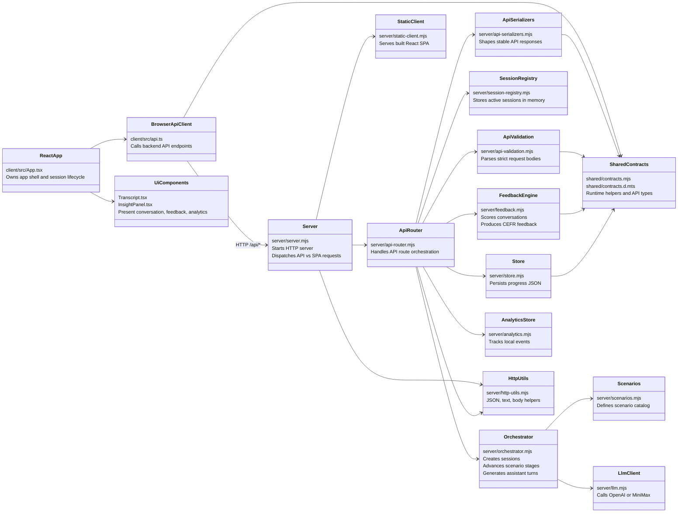
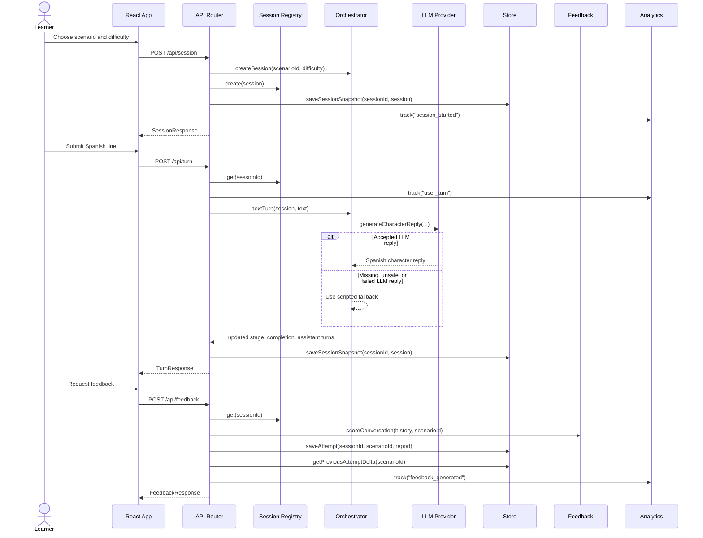

# Spanish Sim Architecture UML

## Component Diagram

```mermaid
classDiagram
  direction LR

  class ReactApp {
    client/src/App.tsx
    Owns app shell and session lifecycle
  }

  class BrowserApiClient {
    client/src/api.ts
    Calls backend API endpoints
  }

  class UiComponents {
    Transcript.tsx
    InsightPanel.tsx
    Present conversation, feedback, analytics
  }

  class SharedContracts {
    shared/contracts.mjs
    shared/contracts.d.mts
    Runtime helpers and API types
  }

  class Server {
    server/server.mjs
    Starts HTTP server
    Dispatches API vs SPA requests
  }

  class ApiRouter {
    server/api-router.mjs
    Handles API route orchestration
  }

  class ApiValidation {
    server/api-validation.mjs
    Parses strict request bodies
  }

  class ApiSerializers {
    server/api-serializers.mjs
    Shapes stable API responses
  }

  class SessionRegistry {
    server/session-registry.mjs
    Stores active sessions in memory
  }

  class Orchestrator {
    server/orchestrator.mjs
    Creates sessions
    Advances scenario stages
    Generates assistant turns
  }

  class Scenarios {
    server/scenarios.mjs
    Defines scenario catalog
  }

  class LlmClient {
    server/llm.mjs
    Calls OpenAI or MiniMax
  }

  class FeedbackEngine {
    server/feedback.mjs
    Scores conversations
    Produces CEFR feedback
  }

  class Store {
    server/store.mjs
    Persists progress JSON
  }

  class AnalyticsStore {
    server/analytics.mjs
    Tracks local events
  }

  class StaticClient {
    server/static-client.mjs
    Serves built React SPA
  }

  class HttpUtils {
    server/http-utils.mjs
    JSON, text, body helpers
  }

  ReactApp --> BrowserApiClient
  ReactApp --> UiComponents
  BrowserApiClient --> SharedContracts
  BrowserApiClient --> Server : HTTP /api/*

  Server --> ApiRouter
  Server --> StaticClient
  Server --> HttpUtils

  ApiRouter --> ApiValidation
  ApiRouter --> ApiSerializers
  ApiRouter --> SessionRegistry
  ApiRouter --> Orchestrator
  ApiRouter --> FeedbackEngine
  ApiRouter --> Store
  ApiRouter --> AnalyticsStore
  ApiRouter --> HttpUtils

  ApiSerializers --> SharedContracts
  ApiValidation --> SharedContracts
  Orchestrator --> Scenarios
  Orchestrator --> LlmClient
  FeedbackEngine --> SharedContracts
  Store --> SharedContracts
```

## Conversation Flow

```mermaid
sequenceDiagram
  actor Learner
  participant App as React App
  participant Api as API Router
  participant Sessions as Session Registry
  participant Orchestrator
  participant LLM as LLM Provider
  participant Store
  participant Feedback
  participant Analytics

  Learner->>App: Choose scenario and difficulty
  App->>Api: POST /api/session
  Api->>Orchestrator: createSession(scenarioId, difficulty)
  Api->>Sessions: create(session)
  Api->>Store: saveSessionSnapshot(sessionId, session)
  Api->>Analytics: track("session_started")
  Api-->>App: SessionResponse

  Learner->>App: Submit Spanish line
  App->>Api: POST /api/turn
  Api->>Sessions: get(sessionId)
  Api->>Analytics: track("user_turn")
  Api->>Orchestrator: nextTurn(session, text)
  Orchestrator->>LLM: generateCharacterReply(...)
  alt Accepted LLM reply
    LLM-->>Orchestrator: Spanish character reply
  else Missing, unsafe, or failed LLM reply
    Orchestrator-->>Orchestrator: Use scripted fallback
  end
  Orchestrator-->>Api: updated stage, completion, assistant turns
  Api->>Store: saveSessionSnapshot(sessionId, session)
  Api-->>App: TurnResponse

  Learner->>App: Request feedback
  App->>Api: POST /api/feedback
  Api->>Sessions: get(sessionId)
  Api->>Feedback: scoreConversation(history, scenarioId)
  Api->>Store: saveAttempt(sessionId, scenarioId, report)
  Api->>Store: getPreviousAttemptDelta(scenarioId)
  Api->>Analytics: track("feedback_generated")
  Api-->>App: FeedbackResponse
```
